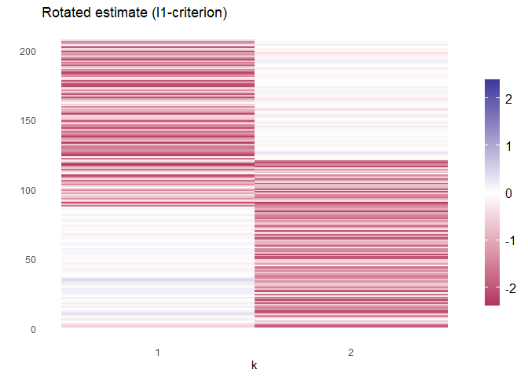

<!-- badges: start -->

[](https://CRAN.R-project.org/package=l1rotation)
[](https://r-pkg.org/pkg/l1rotation)
<!-- badges: end -->

## Overview

The **l1rotation** package implements the l1-rotation rotation criterion
to identify and estimate the loadings matrix in factor models following
[Freyaldenhoven
(2025)](https://simonfreyaldenhoven.github.io/papers/factor_rotation.pdf).

## Installation

``` r
# Install from CRAN
install.packages("l1rotation")

# Install latest version from GitHub
install.packages("devtools")
devtools::install_github("SimonFreyaldenhoven/l1rotation")
```

## Usage

Find a minimal example below. For more examples see the package
[documentation](https://cran.r-project.org/package=l1rotation/l1rotation.pdf)
and
[vignette](https://cran.r-project.org/package=l1rotation/vignettes/documentation.html).

``` r

library(l1rotation)
set.seed(916) 

# Minimal example with 4 factors, where X is a 224 by 207 matrix
lf <- local_factors(X = example_data, r = 2)

# Rerun with parallel processing
lf_lambdas <- find_local_factors(X = example_data, r = 2, parallel = TRUE, n_cores = 10)

# Visualize Principal Component estimate of the loadings
lf$pc_plot
```

<!-- -->

``` r

# Visualize l1-rotation loadings
lf$pc_rotated_plot
```

<!-- -->

## Citation

Simon Freyaldenhoven.”Identification Through Sparsity in Factor Models:
the l1-rotation criterion” [Working
Paper](https://simonfreyaldenhoven.github.io/papers/factor_rotation.pdf),
February 2025.

Simon Freyaldenhoven, Ryan Kobler. “`l1rotation` package.” Code and data
repository at <https://github.com/SimonFreyaldenhoven/l1rotation>, March
2025.
